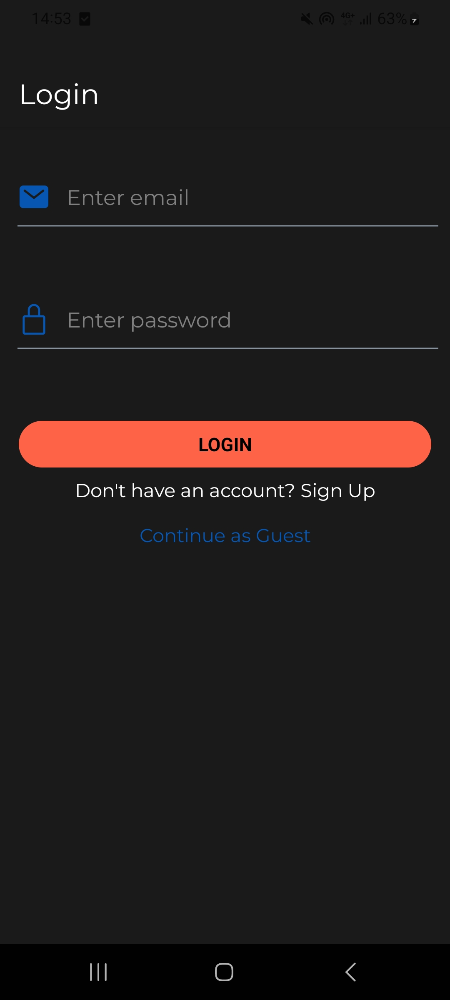

# DiaLog

### **About**
DiaLog is a React Native mobile app for managing type 2 diabetes or pre-diabetes with the help of machine learning. 
It has features such as glucose logging, ML-driven alerts, macro recommendations and trend data visualizations. This app was built using Expo and Firebase as a backend.
[WIP]

### **Why?**
  The aim of this project was to help people with type 2 diabetes or pre-diabetes to keep track of their glucose logs and make sense of the data they gather instead of trying to do this manually, to keep an eye on what periods of their life their glucose seems abnormal and adjust accordingly. 
  To aid this aim I also added features such as macro recommendations as a general guide for the specific individual after they have completed a questionnaire on their information such as weight, height, age, etc. 
  It also has an intuitive medication reminder where the users can add, delete, or edit the medication they need to take and the app will remind them when the time comes. 
    This app is also foresought to be used by people who are not diagnosed with type 2 diabetes or pre-diabetes but would like to use the app to see what their glucose trends look like and determine if their chances of getting diabetes are high/low using machine learning and if they should take action to prevent diabetes. 

### **Where the project is at the moment and where we're heading:**
At this point, the UI/UX of the project is completed. After some feedback from mentors, it is decided on removing one of the features and making the remaining as good as they can possibly be. 
  The app is currently using a rule-based system for alerting alarming glucose trends. Soon, after thourough research on which algorithm is best to use, a ML algorithm will be implemented such as a Decision Tree or Logistic Regression for diabetes prediciton in people who have not yet been diagnosed or people with pre-diabetes.

## **What the app looks like**

#### Login Page

  
